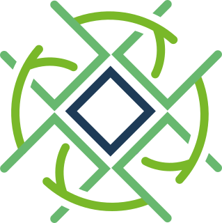

# Block Roots

Test Hackaton Fork The System II landing challenge:
 https://oriojas.github.io/landing_block_roots/




## url graph

https://thegraph.com/studio/subgraph/block_root_ii/

## Contract address

https://rinkeby.etherscan.io/address/0xD9F875600610dAC4ca898DFa67438B90Cad3Ebc2

## Api URL

https://api.studio.thegraph.com/query/23301/block_root_ii/v0.0.4

### Test query

```graphql
query MyQuery {
  pushDatas(orderDirection: asc, orderBy: amount, where: {packing: "Unidad"}) {
    amount
    batch
    businessName
    count
    id
    name
    origin
    packing
    product
  }
}		
```

### Sample response

```json
{
  "data": {
    "pushDatas": [
      {
        "amount": "19",
        "batch": "457/87",
        "businessName": "Artesanias nuevo mundo",
        "count": "12",
        "id": "0x5027323b073841dfb6481f2a2aff38c1f393b9fb",
        "name": "Artesania en arcilla",
        "origin": "Raquira",
        "packing": "Unidad",
        "product": "Alcancias en forma de persona pintadas a mano colores varios"
      }
    ]
  }
}

```
